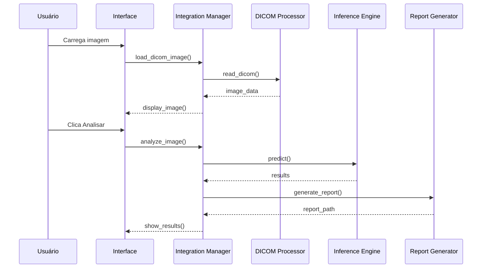
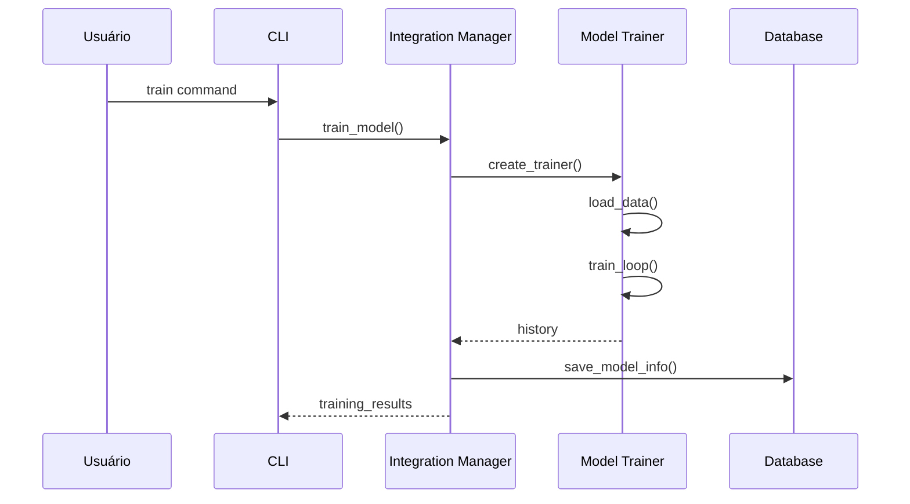

# MedAI - Documentação de Arquitetura Técnica

## 🏗️ Visão Geral da Arquitetura

O MedAI foi projetado seguindo princípios de arquitetura limpa, modularidade e extensibilidade. O sistema utiliza vários padrões de design para garantir manutenibilidade e escalabilidade.

## 📐 Princípios Arquiteturais

### 1. Separação de Responsabilidades
- **Camada de Apresentação**: GUI (PyQt5) e CLI (Click)
- **Camada de Lógica de Negócios**: Integration Manager e módulos especializados
- **Camada de Dados**: DICOM processor, Database manager
- **Camada de IA**: Modelos, treinamento e inferência

### 2. Padrões de Design Utilizados

#### Facade Pattern
O `MedAIIntegrationManager` implementa o padrão Facade, fornecendo uma interface unificada para todos os subsistemas complexos.

```python
class MedAIIntegrationManager:
    def __init__(self):
        self.dicom_processor = DicomProcessor()
        self.security_manager = SecurityManager()
        self.pacs_integration = PACSIntegration()
        # ... outros componentes
    
    def analyze_image(self, image_data, model_name):
        # Interface simplificada que coordena múltiplos componentes
        pass
```

#### Strategy Pattern
Os diferentes modelos de IA implementam uma interface comum, permitindo troca dinâmica de algoritmos.

```python
class BaseModel(ABC):
    @abstractmethod
    def build_model(self):
        pass
    
    @abstractmethod
    def preprocess(self, image):
        pass

class DenseNetModel(BaseModel):
    def build_model(self):
        # Implementação específica DenseNet
        pass
```

#### Observer Pattern
O sistema de análise em thread utiliza sinais Qt para notificar a GUI sobre mudanças de estado.

```python
class AnalysisThread(QThread):
    progress = pyqtSignal(int)
    status = pyqtSignal(str)
    result = pyqtSignal(dict)
    error = pyqtSignal(str)
```

#### Singleton Pattern
O `SecurityManager` garante uma única instância para gerenciar autenticação e autorização.

## 🔧 Componentes Principais

### 1. Integration Manager
**Arquivo**: `medai_integration_manager.py`

**Responsabilidades**:
- Coordenação central de todos os módulos
- Gerenciamento de sessão e estado
- Aplicação de regras de negócio
- Controle de acesso baseado em permissões

**Principais Métodos**:
```python
- login(username, password)
- load_dicom_image(file_path, anonymize)
- analyze_image(image_data, model_name)
- batch_analyze(directory_path, model_name)
- compare_images(image1_data, image2_data)
- train_model(data_dir, model_name, epochs)
- generate_report(analysis_results, report_type)
- query_pacs(patient_id, study_date, modality)
```

### 2. DICOM Processor
**Arquivo**: `medai_dicom_processor.py`

**Responsabilidades**:
- Leitura e escrita de arquivos DICOM
- Extração de metadados
- Anonimização de dados sensíveis
- Aplicação de janelamento (windowing)

**Estrutura de Dados**:
```python
{
    'image': numpy.ndarray,      # Array de pixels
    'metadata': {
        'patient_id': str,
        'patient_name': str,
        'modality': str,
        'study_date': str,
        'window_center': int,
        'window_width': int,
        # ... outros metadados
    }
}
```

### 3. Modelos de IA
**Arquivo**: `medai_ai_models.py`

**Arquiteturas Implementadas**:

#### DenseNet-121
- **Uso**: Classificação geral
- **Características**: Conexões densas entre camadas
- **Vantagens**: Reutilização de features, menos parâmetros

#### ResNet-50
- **Uso**: Classificação robusta
- **Características**: Blocos residuais
- **Vantagens**: Treina redes muito profundas

#### Attention U-Net
- **Uso**: Segmentação
- **Características**: Mecanismo de atenção
- **Vantagens**: Foco em regiões relevantes

### 4. Sistema de Treinamento
**Arquivo**: `medai_training_system.py`

**Pipeline de Treinamento**:
1. **Data Loading**: Generators com augmentation
2. **Model Building**: Criação da arquitetura
3. **Compilation**: Otimizador, loss, métricas
4. **Training Loop**: Com callbacks
5. **Evaluation**: Métricas clínicas
6. **Saving**: Checkpoints e modelo final

**Callbacks Utilizados**:
- `ModelCheckpoint`: Salva melhor modelo
- `EarlyStopping`: Evita overfitting
- `ReduceLROnPlateau`: Ajusta learning rate
- `TensorBoard`: Visualização (opcional)

### 5. Motor de Inferência
**Arquivo**: `medai_inference_engine.py`

**Funcionalidades**:
- Predição single/batch
- Análise de incerteza (entropia, margem)
- Geração de mapas de atenção (Grad-CAM)
- Métricas de confiança

**Fluxo de Inferência**:
```
Imagem → Pré-processamento → Modelo → Pós-processamento → Resultado
                                ↓
                          Mapa de Atenção
```

### 6. Sistema de Comparação
**Arquivo**: `medai_comparison_system.py`

**Algoritmos**:
- **Registro de Imagem**: SimpleITK
- **Métricas de Similaridade**: SSIM, MSE
- **Detecção de Mudanças**: Threshold adaptativo
- **Análise de Progressão**: Taxa temporal

### 7. Visualização Avançada
**Arquivo**: `medai_advanced_visualization.py`

**Recursos**:
- **2D**: Zoom, pan, windowing
- **3D**: Renderização volumétrica
- **MPR**: Reconstrução multiplanar
- **MIP**: Projeção de intensidade máxima
- **Medições**: Distância, área, ângulo

### 8. Gerador de Relatórios
**Arquivo**: `medai_report_generator.py`

**Formatos Suportados**:
- **PDF**: ReportLab
- **HTML**: Jinja2 templates
- **DICOM SR**: Structured Reports
- **HL7**: Mensagens ORU
- **FHIR**: Resources JSON

### 9. Segurança
**Arquivo**: `medai_security_manager.py`

**Implementação**:
- **Autenticação**: bcrypt para hash de senhas
- **Autorização**: RBAC (Role-Based Access Control)
- **Tokens**: JWT com expiração
- **Auditoria**: SQLite com timestamp e ações
- **Criptografia**: Fernet (AES-256)

## 📊 Fluxos de Dados

### Fluxo de Análise de Imagem


### Fluxo de Treinamento


## 🔌 Interfaces e APIs

### API Interna
Todos os módulos se comunicam através do Integration Manager:

```python
# Exemplo de uso interno
result = integration_manager.analyze_image(
    image_data={'image': array, 'metadata': {}},
    model_name='densenet',
    generate_attention_map=True
)
```

### API REST (Futura)
Planejada para implementação futura usando FastAPI:

```python
@app.post("/api/v1/analyze")
async def analyze_image(
    file: UploadFile,
    model: str = "densenet",
    token: str = Header(...)
):
    # Implementação da API
    pass
```

## 🗄️ Estrutura de Dados

### Banco de Dados (SQLite)

#### Tabela: users
```sql
CREATE TABLE users (
    id INTEGER PRIMARY KEY,
    username TEXT UNIQUE NOT NULL,
    password_hash TEXT NOT NULL,
    role TEXT NOT NULL,
    name TEXT,
    email TEXT,
    created_at TIMESTAMP,
    last_login TIMESTAMP
);
```

#### Tabela: audit_log
```sql
CREATE TABLE audit_log (
    id INTEGER PRIMARY KEY,
    username TEXT NOT NULL,
    action TEXT NOT NULL,
    details TEXT,
    timestamp TIMESTAMP,
    ip_address TEXT
);
```

### Formato de Resultados
```python
{
    'prediction': int,              # Classe predita
    'confidence': float,            # Confiança (0-1)
    'uncertainty': {
        'entropy': float,           # Entropia da distribuição
        'margin': float,            # Margem entre top-2 classes
        'top_k_variance': float     # Variância das top-k predições
    },
    'attention_map': numpy.ndarray, # Mapa de calor Grad-CAM
    'model_name': str,              # Modelo utilizado
    'timestamp': datetime,          # Horário da análise
    'clinical_interpretation': str  # Texto interpretativo
}
```

## 🚀 Extensibilidade

### Adicionando Novo Modelo

1. **Criar classe do modelo** em `medai_ai_models.py`:
```python
class NewModel(BaseModel):
    def build_model(self):
        # Implementar arquitetura
        pass
    
    def preprocess(self, image):
        # Implementar pré-processamento
        pass
```

2. **Registrar no Integration Manager**:
```python
self.available_models['new_model'] = NewModel
```

3. **Atualizar interfaces** (GUI/CLI) para incluir nova opção.

### Adicionando Nova Modalidade

1. **Estender DICOM Processor** para lidar com nova modalidade
2. **Adaptar pré-processamento** específico
3. **Treinar modelos** para a modalidade
4. **Atualizar validações** e metadados

### Integrando Novo Sistema Hospitalar

1. **Implementar adaptador** seguindo interface comum
2. **Adicionar mapeamento** de formatos
3. **Configurar conectividade** e segurança
4. **Testar interoperabilidade**

## 🧪 Testes

### Estrutura de Testes
```
tests/
├── unit/
│   ├── test_dicom_processor.py
│   ├── test_models.py
│   └── test_security.py
├── integration/
│   ├── test_analysis_flow.py
│   └── test_pacs_integration.py
└── performance/
    ├── test_batch_processing.py
    └── test_model_inference.py
```

### Executar Testes
```bash
# Todos os testes
pytest

# Com cobertura
pytest --cov=medai --cov-report=html

# Testes específicos
pytest tests/unit/test_models.py
```

## 📈 Performance e Otimização

### Otimizações Implementadas

1. **Processamento em Batch**: ThreadPoolExecutor para paralelização
2. **Cache de Modelos**: Modelos carregados mantidos em memória
3. **Lazy Loading**: Componentes carregados sob demanda
4. **Quantização**: Suporte para modelos quantizados (INT8)

### Benchmarks Esperados

| Operação | CPU | GPU |
|----------|-----|-----|
| Análise Single | 2-3s | 0.5-1s |
| Batch (100 imgs) | 200s | 50s |
| Treinamento/época | 300s | 60s |

## 🔒 Considerações de Segurança

### Princípios Seguidos

1. **Principle of Least Privilege**: Usuários têm acesso mínimo necessário
2. **Defense in Depth**: Múltiplas camadas de segurança
3. **Secure by Default**: Configurações seguras por padrão
4. **Audit Everything**: Todas ações são registradas

### Fluxo de Autenticação
```
Login → Validação → Token JWT → Verificação em cada requisição
                         ↓
                    Refresh Token (se expirado)
```

## 🌐 Escalabilidade

### Estratégias para Escalar

1. **Horizontal**: 
   - Múltiplas instâncias do Integration Manager
   - Load balancer para distribuir requisições
   - Cache distribuído (Redis)

2. **Vertical**:
   - GPUs mais poderosas
   - Mais memória RAM
   - SSDs para I/O rápido

3. **Cloud-Native**:
   - Containerização com Docker
   - Orquestração com Kubernetes
   - Armazenamento em cloud (S3, GCS)

## 📝 Melhores Práticas

### Código

1. **Type Hints**: Use anotações de tipo
2. **Docstrings**: Documente todas as funções
3. **Error Handling**: Trate exceções apropriadamente
4. **Logging**: Use níveis apropriados (DEBUG, INFO, ERROR)

### Git

1. **Branches**: feature/, bugfix/, hotfix/
2. **Commits**: Mensagens descritivas
3. **Pull Requests**: Code review obrigatório
4. **Tags**: Versionamento semântico

### Deployment

1. **CI/CD**: Testes automáticos antes do merge
2. **Staging**: Ambiente de teste idêntico à produção
3. **Rollback**: Estratégia clara de reversão
4. **Monitoring**: Logs e métricas em tempo real

## 🔄 Roadmap Futuro

### v1.1
- [ ] API REST completa
- [ ] Suporte para mais modalidades (US, MG)
- [ ] Interface web

### v1.2
- [ ] Aprendizado federado
- [ ] Modelos 3D nativos
- [ ] Integração com EHR

### v2.0
- [ ] IA explicável avançada
- [ ] AutoML para otimização
- [ ] Multi-tenancy

## 📚 Referências Técnicas

1. **Deep Learning**: 
   - Goodfellow et al., "Deep Learning" (2016)
   - LeCun et al., "Deep learning" Nature (2015)

2. **Medical Imaging AI**:
   - Litjens et al., "A survey on deep learning in medical image analysis" (2017)
   - Shen et al., "Deep Learning in Medical Image Analysis" (2017)

3. **DICOM Standard**:
   - DICOM PS3.1-2023: Introduction and Overview
   - DICOM PS3.3-2023: Information Object Definitions

4. **Regulatory**:
   - FDA, "Artificial Intelligence/Machine Learning-Based Software as a Medical Device"
   - ANVISA RDC 657/2022

---

Esta documentação técnica fornece uma visão abrangente da arquitetura do MedAI. Para questões específicas ou contribuições, consulte o guia de contribuição ou entre em contato com a equipe de desenvolvimento.